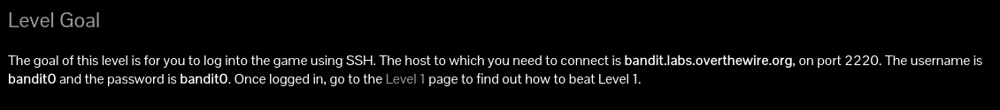
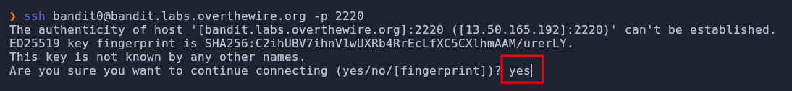
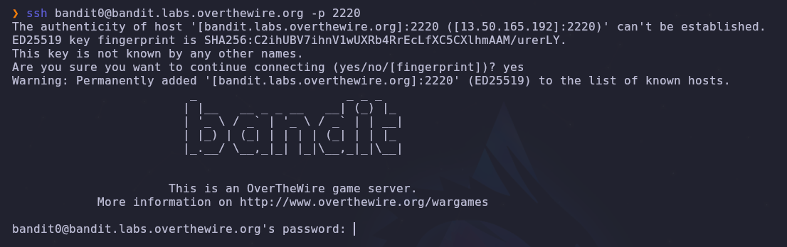
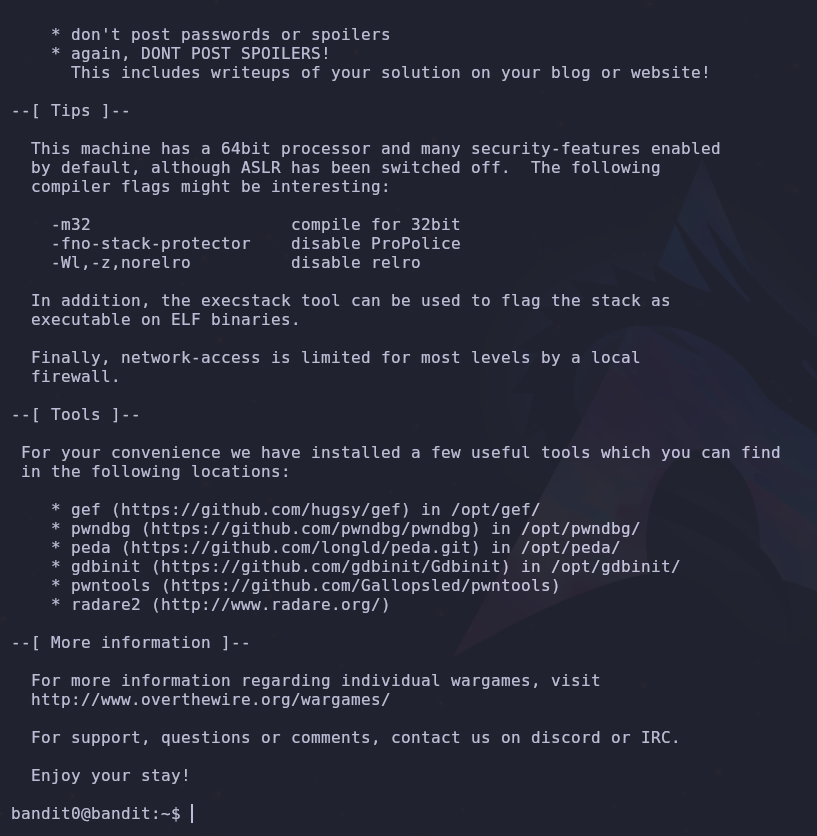

---

---
- - -

## Índice 
- [Introducción](#introducción) 
- [Metodología](#metodología) 
- [Resultados](#resultados) 
- [Conclusiones](#conclusiones)

---

### Introducción

En este archivo se encuentra la documentación del objetivo [Bandit 0](https://overthewire.org/wargames/bandit/bandit0.html), el cual será el primero de muchos retos que nos permitirán introducirnos al hacking ético.

---

### Metodología

La [página web del reto](https://overthewire.org/wargames/bandit/bandit0.html) nos ofrece una serie de puntos:


Podemos observar que contamos con una descripción, un listado de comandos requeridos para resolverlo y, además, un par de enlaces que nos ofrecen material extra que nos ayudará con el reto.

---

Desglosemos la información que nos brinda:

* Objetivo:



Podemos ver que nos pide iniciar sesión mediante algo llamado **SSH**, nos proporciona el host **bandit.labs.overthewire.org** y además nos dice que es en el puerto **2220**, que el usuario es **bandit0** y por ultimo nos da la contraseña **bandit0**.

---

* Comandos


Aquí nos damos cuenta de que deberemos utilizar un comando en el reto: este comando es SSH, el cual ya habíamos visto en el objetivo y mediante el cual se nos pedía iniciar sesión.

---

* Material de ayuda


En el material de ayuda podemos consultar más acerca de SSH, [el primer link](https://en.wikipedia.org/wiki/Secure_Shell) nos ofrece información un poco más general que ayuda a familiarizarse con la herramienta

---

* Solución



En una sección podemos observar que podemos utilizar SSH en Linux, macOS y versiones posteriores a Windows 10 versión 1709.

En [el segundo link](https://www.wikihow.com/Use-SSH) inicia explicandonos en los pasos 1 y 2 como instalar Cygwin Terminal en el cual podremos utilizar ssh.

Una vez instalado en el paso 3 nos explica como conectarnos:

una

el comando usado es ssh \<username>@\<remote> y recordemos que en el objetivo nos facilito estos datos:
* **comando:** ssh
* **host:** bandit.labs.overthewire.org
* **puerto:** 2220
* **usuario:** bandit0
* **contraseña:** bandit0

Así que realizamos las debidas sustituciones en el comando:
```bash 
ssh bandit0@<remote> -p 2220
```

Nos falta saber que es remote y la contraseña menciona que se coloca una vez que la conexión se ha realizado, dado que el unico dato que nos queda es host podemos utilizarlo en \<remote\> aunque si investigas un poco más o conoces del tema sabrás que el host es una computadora que está conectada a una red (que en este caso es internet) y remote en el caso específico del comando ssh se refiere a ese host al que deseas realizar la conexión por lo que el comando nos quedaría de la siguiente forma:
```bash 
ssh bandit0@bandit.labs.overthewire.org -p 2220
```

El cual, al ejecutarlo en la terminal que habíamos instalado, se ve de la siguiente manera:


escribimos yes como indica el tutorial de ssh y nos solicitará una contraseña, recordemos que ya nos la habían dado y es "bandit0" así que la colocamos en ese espacio:


Y si colocamos la contraseña nos conecta a una máquina linux que de entrada nos ofrece una variedad de mensajes dandonos la bienvenida a **OverTheWire**, ofreciendonos más juegos, tips herramientas e información.



---

### Conclusiones

Este reto nos planteó un sencillo desafío en el que nos ofrecía todo lo necesario para resolverlo, con el fin de poder utilizar SSH para conectarnos a una máquina y acceder a los siguientes retos que nos permitirán aprender sobre el campo de la ciberseguridad.